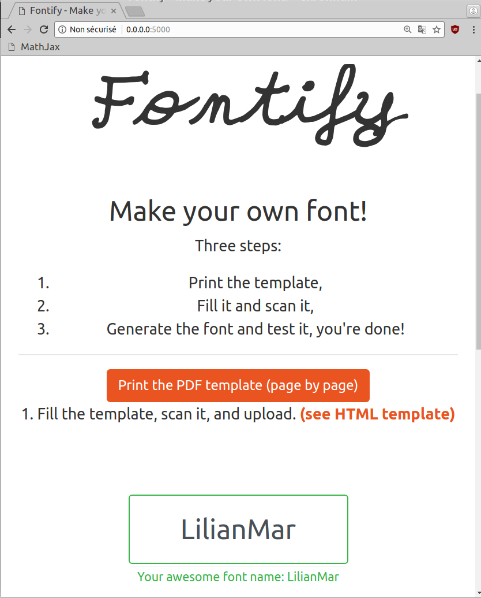
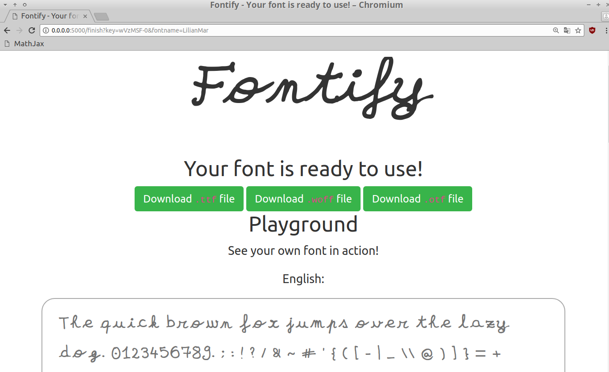

# Fontify
**Make your own typeface from your handwriting!**

- Download a PDF template to print and fill,
- Scan it with DPI >= 300,
- Upload your beautiful handwriting to the webapp,
- It creates a TrueType font, and let you preview it,
- If you are happy, save it and start to use it!
- See [this demo](https://github.com/Naereen/My-Own-HandWritting-Font) showing how a font generated with Fontify can look.

## Demo

> Here are a few screenshots of the webapp:






## Development (*only* on Debian/Ubuntu)

> - It *only* works on Python 2, so far (but I'm almost sure it would also work for Python 3).
> - I will try to set up a Docker image to ease this experiment.

1. First clone and `cd` into the repository.

```shell
cd /tmp/
git clone https://github.com/Naereen/fontify
cd fontify
git submodule init
git submodule update
```

2. Install all the dependencies.

```shell
sudo apt-get install potrace imagemagick fontforge fontforge-extras wkhtmltopdf python-opencv python-fontforge
npm install -g ttf2woff
sudo pip2 install --upgrade virtualenv
```

3. Activate a virtualenv and start the app!

```shell
virtualenv env
source env/bin/activate
type pip python   # check that this is the local ones
pip install -r requirements.txt
python hello.py  # or 'make rundebug'
```

4. And open the app to use it!

```shell
firefox http://0.0.0.0:5000/ &
```

5. Note: in "development mode", the app is relaunched whenever a file is modified. Use `make run` to run "in production" mode.

6. To open the app to anyone on Internet, you can use [ngrok](https://ngrok.com/) (and also, be crazy, as this app has NO GUARANTEE TO BE SECURE):

```shell
ngrok http 5000
```

7. There is also a [XeLaTeX file](static/test.tex) showing how to use a custom font in a LaTeX document, and [here is how it looks](https://perso.crans.org/besson/publis/latex/test_handwritten_font_with_fontify.pdf).

---

### :scroll: License ? [](https://github.com/Naereen/fontify/blob/master/LICENSE)
This (small) repository are published under the terms of the [MIT license](http://lbesson.mit-license.org/) (file [LICENSE](LICENSE)).
© [Lilian Besson](https://GitHub.com/Naereen), 2018.

[](https://GitHub.com/Naereen/fontify/graphs/commit-activity)
[](https://GitHub.com/Naereen/fontify)
[](https://GitHub.com/Naereen/fontify/)

[](https://GitHub.com/Naereen/)
[](http://ForTheBadge.com)
[](http://ForTheBadge.com)
[](http://ForTheBadge.com)
[](http://ForTheBadge.com)
[](https://GitHub.com/)
